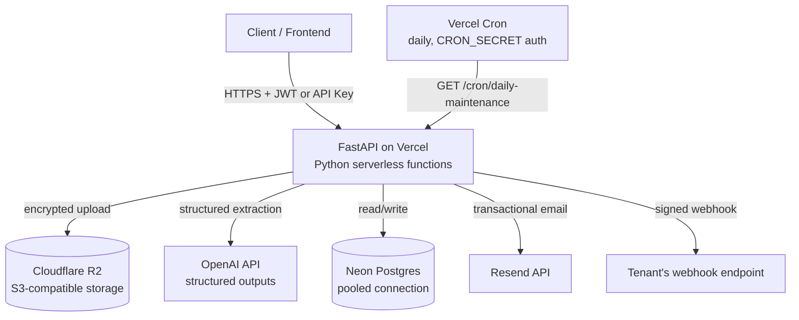

# ClauseWatch — Backend

A multi-tenant contract intelligence API. Upload a contract (PDF/DOCX), and it automatically extracts parties, key dates, notice periods, and termination terms via an LLM — each field with a confidence score — flags anything uncertain for human review, and sends reminders before renewal deadlines.

**Live API:** https://clausewatch-viewer.vercel.app
**Frontend:** https://clause-watch-tracker.vercel.app · [frontend repo](https://github.com/hriday1136/ClauseWatch-frontend)

---

## Architecture



Every contract upload runs synchronously, end to end, inside a single serverless function invocation: file upload → encryption → storage → text extraction → LLM structured extraction → persistence. There is no background worker or task queue — this was a deliberate architectural pivot (see [Architecture Decisions](#architecture-decisions) below).

## Tech Stack

- **Framework:** FastAPI (Python), deployed as Vercel serverless functions
- **Database:** PostgreSQL via [Neon](https://neon.tech) (serverless, connection-pooled for a per-request execution model), SQLAlchemy 2.0 (typed ORM), Alembic (migrations)
- **Object storage:** Cloudflare R2 (S3-compatible), accessed via `boto3`, with application-level Fernet encryption at rest
- **LLM:** OpenAI structured outputs (`responses.parse`) for schema-constrained clause extraction
- **Auth:** Dual — API keys (SHA-256 hashed) for programmatic clients, JWT (`pyjwt`) for the frontend, both accepted on the same endpoints
- **Email:** Resend
- **Validation/config:** Pydantic v2, `pydantic-settings`
- **Scheduling:** Vercel Cron (no Celery/Redis — see below)
- **Observability:** Structured JSON logging with per-request correlation IDs, Prometheus metrics (`prometheus_client`)
- **Testing:** `pytest` — automated tenant-isolation suite, extraction accuracy fixtures
- **Password hashing:** PBKDF2-HMAC-SHA256, 600k iterations (stdlib only, current OWASP guidance)

## Features

- **Multi-tenant document upload** (PDF/DOCX), with per-tenant data isolation enforced on every query
- **LLM-based structured extraction**: parties, effective date, renewal date, notice period, termination clause, and payment terms — each with a confidence score and the exact source text it was extracted from
- **Confidence-based human review**: every extraction is reviewable, not just low-confidence ones; a `needs_review` flag (threshold-driven, tunable independently for numeric/date fields vs. narrative text) surfaces what to prioritize checking
- **Full correction audit trail**: `original_value` (from the LLM) and `value` (post-correction) are tracked separately, along with who/when a clause was corrected
- **Scheduled renewal reminders**: daily job checks completed contracts against 90/60/30-day thresholds, dispatches via signed webhooks and email, idempotent (never double-fires)
- **HMAC-signed webhooks**: tenants can subscribe a URL and verify payload authenticity independently
- **Signed, time-limited download links**: proxied through the app (not a direct storage URL) specifically so encryption-at-rest and shareable links can coexist
- **Full account lifecycle**: signup, login, password reset, email verification, API key rotation, webhook management, single/bulk contract deletion, full account deletion — all enumeration-safe (login and signup return identical responses whether or not an account exists)
- **Ephemeral demo accounts**: a self-service "try it now" login creates a throwaway tenant seeded from a curated template, cleaned up on logout with a scheduled backstop for abandoned sessions

## API Overview

| Area | Endpoints |
|---|---|
| Auth | `POST /auth/signup`, `/login`, `/demo-login`, `/forgot-password`, `/reset-password`, `/verify-email`, `/rotate-api-key`, `/delete-account`, `/demo-logout` |
| Contracts | `POST /contracts`, `GET /contracts`, `GET /contracts/{id}`, `PATCH /contracts/{id}/clauses/{clause_id}`, `POST /contracts/{id}/approve`, `DELETE /contracts/{id}`, `DELETE /contracts`, `GET /contracts/upcoming-deadlines`, `GET /contracts/{id}/download-url` |
| Webhooks | `POST /webhooks/subscribe`, `GET /webhooks`, `POST /webhooks/{id}/rotate-secret` |
| Ops | `GET /health`, `GET /metrics`, `GET /cron/daily-maintenance` |

Full interactive docs (OpenAPI/Swagger) are auto-generated by FastAPI at `/docs` on any running instance.

## Security

- Encryption at rest (Fernet/AES) for all stored contract files
- Five independent HMAC-signed token systems, each with its own dedicated secret (never reused across purposes): webhook payloads, download links, password resets, email verification, and cron authentication
- Constant-time comparison (`hmac.compare_digest`) everywhere a secret is checked, preventing timing-based attacks
- Tenant isolation enforced at the query level on every endpoint, verified by an automated test suite (not just assumed)
- API keys and tenant secrets stored as one-way hashes, never in plaintext
- CORS explicitly allow-listed, never wildcarded

## Local Development

```bash
docker compose up -d          # Postgres + MinIO (local S3-compatible storage)
python -m venv venv && venv\Scripts\activate
pip install -r requirements.txt
alembic upgrade head
uvicorn app.main:app --reload
```

Requires a `.env` file (see `.env.example`) with, at minimum: `DATABASE_URL`, `MINIO_*`, `OPENAI_API_KEY`, `RESEND_API_KEY`, `DOCUMENT_ENCRYPTION_KEY`, `DOWNLOAD_LINK_SECRET`, `JWT_SECRET`, `PASSWORD_RESET_SECRET`, `EMAIL_VERIFICATION_SECRET`, `CRON_SECRET`, `DEMO_OWNER_KEY`, `TEMPLATE_TENANT_ID`.

## Testing

```bash
pytest -v
```

Covers automated tenant isolation (cross-tenant access correctly blocked on every endpoint) and extraction accuracy against known-answer sample contracts.

## Architecture Decisions

**Synchronous processing, not async with a task queue.** The original design used Celery + Redis for background contract processing, decoupling the upload response from LLM extraction time. Mid-project, the deployment target changed to Vercel specifically to achieve zero-cost hosting — and Vercel's serverless model cannot run persistent background workers or Redis queues at all. This required removing Celery/Redis entirely and making the upload endpoint fully synchronous (a request now blocks for the real extraction time, ~4–10 seconds, before responding). The daily reminder job moved from Celery Beat to Vercel Cron. This was a deliberate, evaluated tradeoff — not a limitation discovered too late.

**Application-level encryption instead of storage-provider encryption.** MinIO/S3 native server-side encryption requires a separate KMS and TLS termination this project's local dev environment doesn't have. Encrypting file bytes in the application layer (Fernet) before they ever reach storage sidesteps that requirement entirely and is portable across any storage backend.

**Signed download tokens, not presigned storage URLs.** A standard S3 presigned URL gives a client direct access to the raw stored object — which, once encryption at rest was added, would just hand back unreadable ciphertext. The download endpoint is proxied through the app specifically so decryption still happens server-side.

**Human review is default-on, not confidence-gated.** An earlier design only routed low-confidence extractions to a human. This was deliberately changed: LLM-reported confidence scores are not rigorously calibrated probabilities (confirmed empirically — the same contract produced different confidence scores on different extraction runs), so a hard threshold risks either flooding review or silently trusting wrong data. Every extraction is now reviewable; confidence drives *triage priority*, not an automatic pass/fail gate.

## Known Limitations / Next Steps

- No RBAC role enforcement yet (any authenticated user in a tenant can perform any action)
- No rate limiting on auth endpoints
- Reminder metrics from the pre-Vercel-pivot era don't fully carry over to the current single-process Prometheus setup at true multi-worker scale (documented, not blocking at this project's scale)
- Payment-due (e.g. NET-30) reminders are out of scope — they'd require tracking external trigger events (invoices, deliveries) this system doesn't model yet
- No CI pipeline running tests automatically on push
